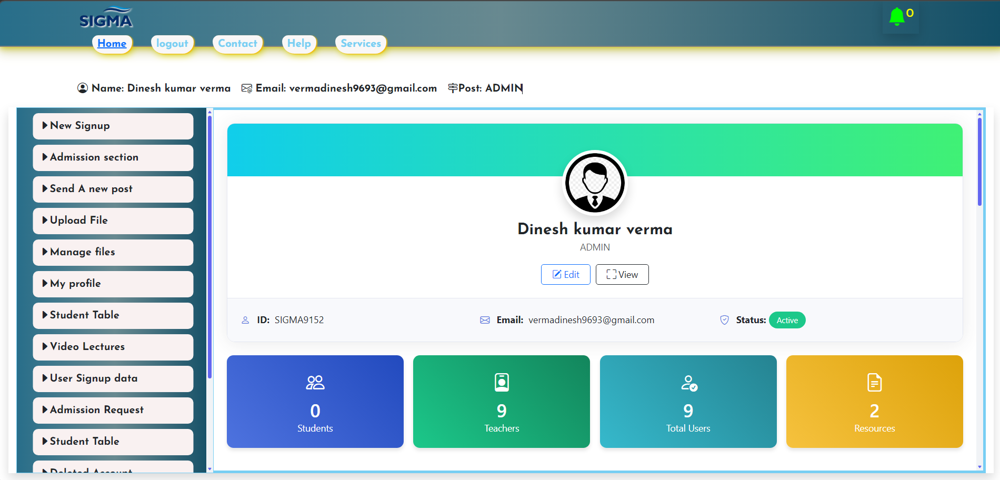
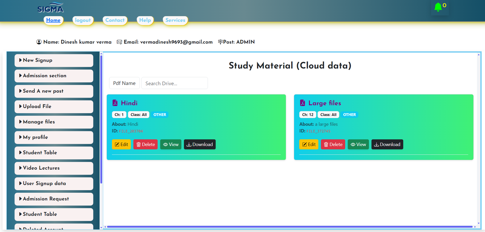

# 🚀 Sigma Institute Web Portal

A full-stack educational web application built with PHP, JavaScript, and cloud-integrated storage architecture. This project demonstrates advanced authentication control, hybrid storage systems, real-time admin management, and Docker-based cloud deployment.

🌐 **Live Preview:** https://sigma-institute.onrender.com/  
📦 **GitHub Repository:** https://github.com/Verma1235/sigma_institute  
🐳 Docker Configuration available in the repository (`You can check GitHub repo Dockerfile`)

---

## 



---

# 🔐 Advanced Authentication & Security

### ✅ Secure Login & Signup System

Structured authentication flow with session-based validation.

### ✅ One Device Login at a Time

- Users can log in on only one device/session simultaneously.
- If a second login occurs, the previous session is automatically terminated.
- Prevents account sharing and enhances security.

### ✅ Forcefully Logout System

- Admin can terminate active sessions.
- Immediate session destruction for restricted users.

### ✅ Login Restricted Section

- Blocked users cannot access protected system areas.
- Role-based access handling.

---

# ☁️ Hybrid Storage Architecture (Cloud + Local)

### 🔹 Google Drive API Integration

- Integrated Google Drive API services.
- Supports 2TB+ scalable cloud storage handling.
- Secure file upload and retrieval logic.

### 🔹 Cloud ↔ Local Storage Switch System

- Switch-case controlled storage engine.
- Admin can instantly migrate all users from:
  - Cloud Storage → Local Server
  - Local Server → Cloud Storage
- Real-time storage routing logic without breaking user sessions.

This simulates enterprise-level hybrid storage control.

---

# 📡 Real-Time Administrative Controls

- Real-time Signup Notification System
- Notification Blocking Mechanism
- Centralized Admin Dashboard Logic
- Approval-Based File Access Section
- Restricted file visibility until approval

---

# 🛠 Tech Stack

- **HTML** – Structure
- **CSS** – Styling
- **JavaScript** – Client-side logic
- **PHP** – Backend processing
- **Sessions** – Authentication & device control
- **Google Drive API** – Cloud storage integration
- **Docker** – Containerization
- **Render** – Cloud deployment

---

# 🐳 Deployment Architecture

This project is fully containerized using Docker and deployed on Render.

### Deployment Flow:

1. Application containerized using Docker.
2. Dockerfile configured for PHP runtime.
3. Deployed to Render cloud platform.
4. Storage routing controlled via backend configuration.

To run locally:

```bash
git clone https://github.com/Verma1235/sigma_institute.git
cd sigma_institute
docker build -t sigma-institute .
docker run -p 8000:8000 sigma-institute


---

If you want next level improvement, I can:

- Add professional badges (Docker, PHP, Render, Cloud, etc.)
- Create an architecture diagram
- Write a technical documentation PDF
- Make your LinkedIn post highlighting these enterprise features

Just tell me 🚀

## 👨‍💻 Developer

**Dinesh Verma**
🔗 LinkedIn: https://www.linkedin.com/posts/dinesh-verma-006623327_webdevelopment-php-javascript-activity-7426161469047705600-grLJ?utm_source=social_share_send&utm_medium=member_desktop_web&rcm=ACoAAFJ-7kYB6hG0xQdA0mtXdL-WqJngktTAWVQ

```
